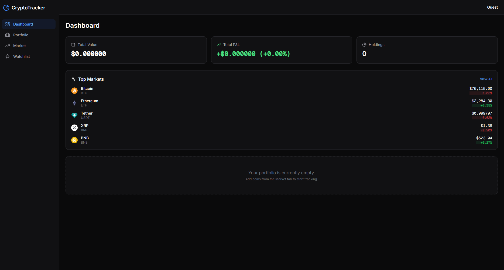
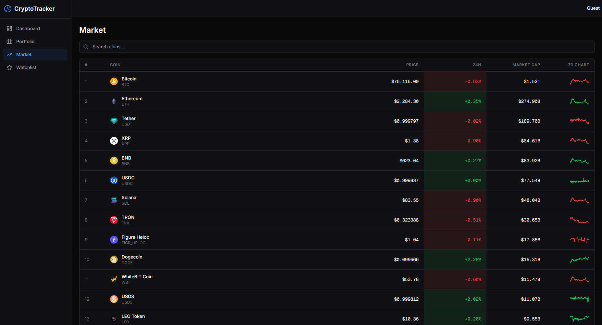

# 🌌 Crypto Portfolio Tracker

A premium, state-of-the-art cryptocurrency portfolio management system built for the modern investor. Track your holdings, monitor market trends, and set smart alerts with a sleek, high-performance interface.


## ✨ Features

- **📊 Real-time Dashboard**: Unified view of your portfolio's total value, P&L, and asset allocation.
- **📈 Binance-Powered Insights**: Lightning-fast charts and market data directly from the **Binance API**.
- **💎 Premium Iconography**: A refined, multi-stage icon system utilizing **CoinCap** and **Binance** asset libraries.
- **🚀 Seamless Exploration**: Infinite scroll enabled Market tab for effortless browsing of thousands of pairs.
- **⭐ Smart Watchlist**: Track your favorite assets with ultra-low latency price updates.
- **🔑 Keyless & Open**: No API keys required for market data.
- **💼 Portfolio Management**: Seamlessly add, update, and track holdings with average buy price and quantity metrics.
- **🌗 Premium UI/UX**: Dark-mode first design with glassmorphism, smooth transitions, and responsive layouts.

## 🛠️ Tech Stack

### Frontend
- **React 18** + **Vite**
- **TailwindCSS** (Custom premium styling)
- **TanStack Query (v5)** (Infinite scroll & data management)
- **Recharts** (Professional-grade visualization)

### Backend
- **Node.js** + **Express 5**
- **Binance API** (Core price engine)
- **Drizzle ORM** + **SQLite**

## 🚀 Getting Started

### Prerequisites
- Node.js 18+ 
- npm or yarn

### Installation

1. **Clone the repository**
   ```bash
   git clone https://github.com/your-username/crypto-portfolio-tracker.git
   cd crypto-portfolio-tracker
   ```

2. **Setup Server**
   ```bash
   cd server
   npm install
   cp .env.example .env 
   npm run db:push     # Initialize the database
   npm run dev         # Start server on http://localhost:3001
   ```

3. **Setup Client**
   ```bash
   cd ../client
   npm install
   npm run dev         # Start client on http://localhost:5173
   ```

## 🔑 Configuration

Create a `.env` file in the `server` directory:

```env
PORT=3001
COINGECKO_API_KEY=your_key_here
BETTER_AUTH_SECRET=your_random_secret
BETTER_AUTH_URL=http://localhost:3001
```

> [!TIP]
> While a CoinGecko API key is optional for limited testing, it is highly recommended to avoid rate limits for the best experience.

## 📱 Screenshots

| Dashboard | Market |
| :---: | :---: |
|  |  |

## 🛡️ License

This project is licensed under the MIT License - see the [LICENSE](LICENSE) file for details.

---
